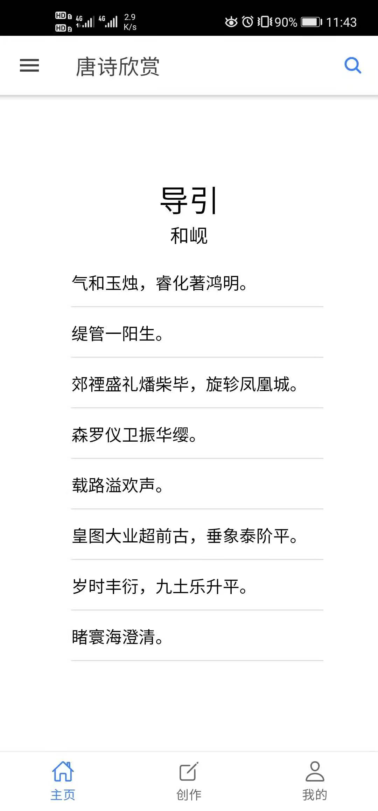
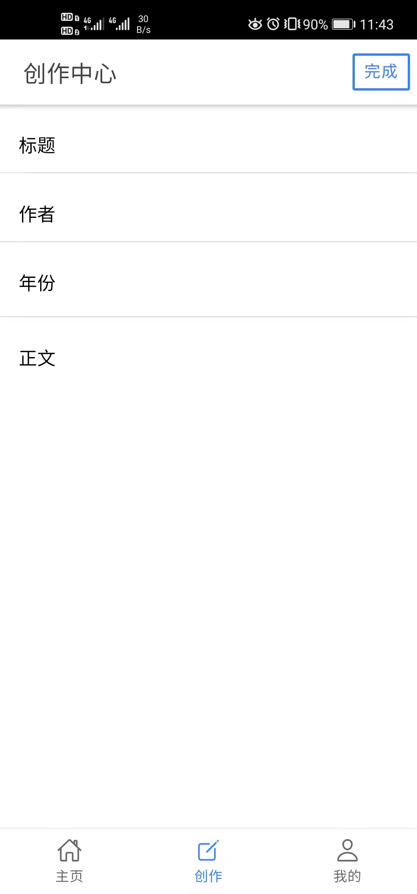
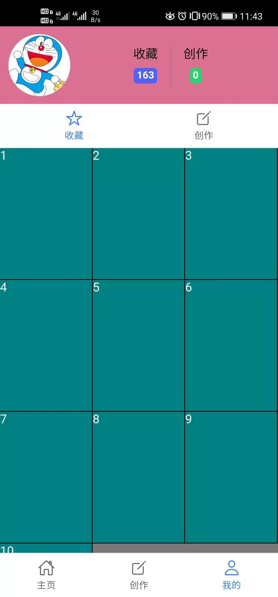
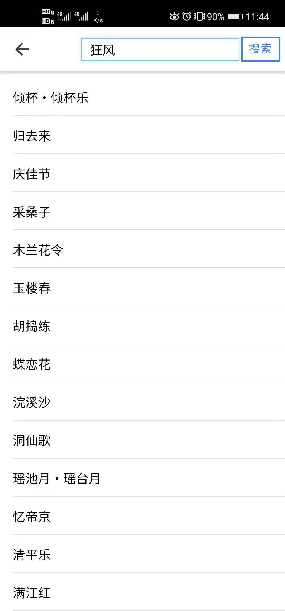

# ionic5-vue
ionic5+vue+sqlite 实现简单的Android本地诗歌App，待完善！
# 构建步骤
** 1. ionic integrations enable capacitor **

** 2. ionic build **

** 3. ionic cap add android **

** 4. ionic cap copy **

** 5. ionic cap open android **

** 6. 在Android Studio中buildAPK即可。**

# 预览

